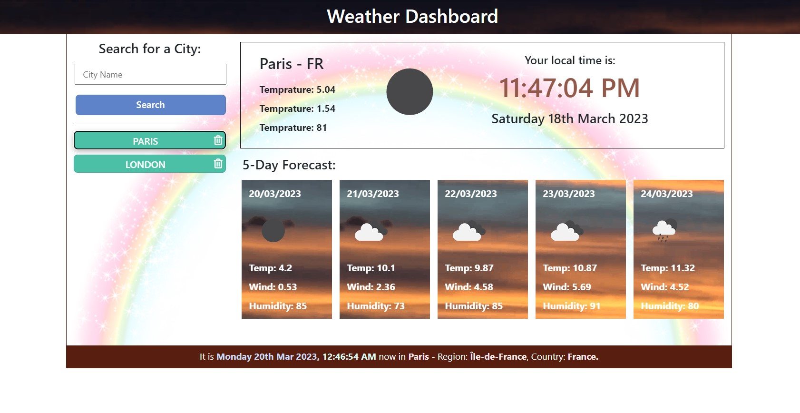

# Weather Dashboard

## Overview

When you consider that there are many weather apps out there, being asked to design one inevitably raises the question. What more can one bring to the table? Nevertheless, I am comforted by the thought that it is not so much about re-inventing the wheel, rather than putting your own stamp on it by the, look, feel, and uniqueness of your design.  This was exactly my focus as I set about this task, create something appealing, user-friendly, and above all one that does the job.

This app should run in any browser, and features dynamically updated HTML and CSS powered by JavaScript and jQuery. It has a clean, polished, and responsive user interface. 

## Description

The Weather App is designed to give you the current weather information on any City of your choice. Not only will you get the weather details for that day, it will also give you a rough idea of what the weather will be like for the next 5 days. Just to give it a tiny bit of uniqueness, as there are many weather apps out there. I thought it would be a good idea to offer the user some more details such as the current time and date of the city searched for. 

## Mock-up

## Website
Click [**here.**](https://rodev-apps.github.io/Weather-Dashboard/) to visit site.

## Usage
Without reading any instructions you can start using the App right away because it is that straight forward and easy to use. As you search, it will store your most recent search providing up to 8 buttons for you to click on saving you the need to type again. Each individual buttons has a delete icon attached to it, which you can click on if you want to get rid of it. After you have added up to 5 buttons, a clear button will appear which does exactly as it says. It will clear all entries and refresh the page. At the bottom you will find some more useful information on that city, such as the time, date, country and region. 

This Repo is made up of the core files and folders related to the task. I have added comments to all the relevant sections of the code, highlighting key areas and the expected result derived from it. The content comprise only that related to the task and I have kept the interface very simple and straight forward to use. It also contains a folder with an animated image of the mock-up depicting the final product. It’s quite straight forward, simply click [**here.**](https://rodev-apps.github.io/Weather-Dashboard/) to begin.

## Feedback

Please feel free to reach out and/or checkout my social media feeds below if you have any questions, queries or suggestions. Thanks.
##### Thanks Rodevs.     
